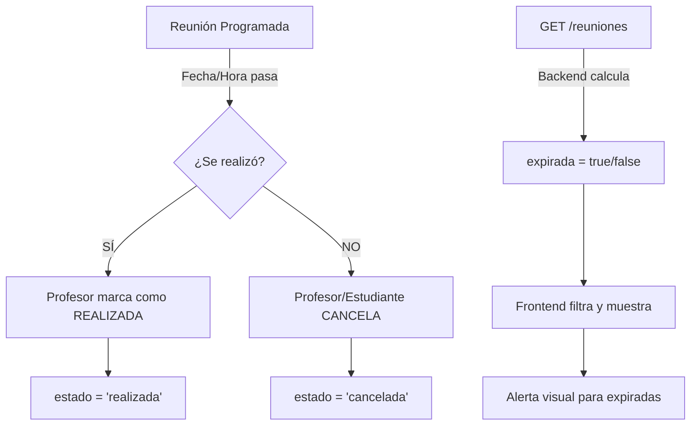

# 📋 Guía: Manejo de Reuniones Expiradas

## 🎯 Solución Implementada: Opción 2 + 3

### **Opción 2: Filtros automáticos**
✅ Las reuniones programadas que ya pasaron se marcan automáticamente como `expirada: true`

### **Opción 3: Interfaz manual para el profesor**
✅ El profesor puede marcar manualmente reuniones como `realizada` o `cancelada`

---

## 🔧 Cambios Realizados

### **Backend**

#### 1. **Modelo `reuniones.model.js`**
- ✅ Función `obtenerReunionesUsuario()` ahora incluye campo calculado `expirada`:
  ```javascript
  CASE 
      WHEN rc.estado = 'programada' 
          AND CONCAT(rc.fecha, ' ', rc.hora_fin) < NOW() 
      THEN TRUE
      ELSE FALSE
  END as expirada
  ```
  - Si la reunión está en estado `'programada'` y la fecha/hora ya pasó → `expirada = true`

#### 2. **Ruta `calendario-matching.route.js`**
- ✅ Nuevo endpoint: `POST /api/calendario-matching/reuniones/:id/marcar-realizada`
  - Solo el **profesor** puede marcar como realizada
  - Actualiza estado a `'realizada'`
  - Registra `fecha_realizacion`
  - Permite agregar `acta_reunion`, `lugar`, `modalidad`

#### 3. **Endpoint existente**: `POST /api/calendario-matching/reuniones/:id/cancelar`
- Ya existía para cancelar reuniones
- Funciona para profesor y estudiante

### **Frontend**

#### 1. **Servicio API (`api.ts`)**
- ✅ Método ya existente: `marcarReunionRealizada(id, data)`
- ✅ Método ya existente: `cancelarReunion(id, data)`
- ✅ Método ya existente: `getReunionesProgramadas()`

---

## 💻 Cómo Usar en el Frontend

### **1. Obtener reuniones con indicador de expiración**

```typescript
// En el componente del profesor o estudiante
this.apiService.getReunionesProgramadas().subscribe({
  next: (response: any) => {
    this.reuniones = response.data;
    
    // Filtrar reuniones expiradas
    this.reunionesExpiradas = this.reuniones.filter(r => 
      r.expirada && r.estado === 'programada'
    );
    
    // Filtrar reuniones próximas
    this.reunionesProximas = this.reuniones.filter(r => 
      !r.expirada && r.estado === 'programada'
    );
  }
});
```

### **2. Marcar reunión como realizada** (Solo profesor)

```typescript
marcarComoRealizada(reunionId: number) {
  const data = {
    acta_reunion: 'Se discutieron los avances del proyecto. El estudiante presentó el capítulo 2.',
    lugar: 'Oficina 302',
    modalidad: 'presencial'
  };
  
  this.apiService.marcarReunionRealizada(reunionId.toString(), data).subscribe({
    next: (response) => {
      console.log('✅ Reunión marcada como realizada');
      this.cargarReuniones(); // Recargar lista
    },
    error: (error) => {
      console.error('❌ Error:', error);
    }
  });
}
```

### **3. Cancelar reunión expirada** (Profesor o estudiante)

```typescript
cancelarReunionExpirada(reunionId: number) {
  const data = {
    motivo: 'Reunión no realizada - El estudiante no asistió'
  };
  
  this.apiService.cancelarReunion(reunionId.toString(), data).subscribe({
    next: (response) => {
      console.log('✅ Reunión cancelada');
      this.cargarReuniones();
    },
    error: (error) => {
      console.error('❌ Error:', error);
    }
  });
}
```

---

## 🎨 Ejemplo de UI para el Profesor

### **Template HTML**

```html
<!-- Reuniones Expiradas (necesitan acción) -->
<div class="seccion-reuniones" *ngIf="reunionesExpiradas.length > 0">
  <h3>⚠️ Reuniones Pasadas (Requieren Acción)</h3>
  
  <div class="reunion-card expirada" *ngFor="let reunion of reunionesExpiradas">
    <div class="reunion-info">
      <h4>{{ reunion.titulo }}</h4>
      <p>
        <i class="fas fa-user"></i> {{ reunion.estudiante_nombre }}<br>
        <i class="fas fa-calendar"></i> {{ reunion.fecha | date:'dd/MM/yyyy' }}<br>
        <i class="fas fa-clock"></i> {{ reunion.hora_inicio }} - {{ reunion.hora_fin }}
      </p>
      <span class="badge badge-warning">Expirada</span>
    </div>
    
    <div class="reunion-actions">
      <button 
        class="btn btn-success"
        (click)="abrirModalRealizada(reunion.id)"
        title="Marcar como realizada">
        <i class="fas fa-check"></i> Se Realizó
      </button>
      
      <button 
        class="btn btn-danger"
        (click)="cancelarReunion(reunion.id)"
        title="Marcar como no realizada">
        <i class="fas fa-times"></i> No se Realizó
      </button>
    </div>
  </div>
</div>

<!-- Reuniones Próximas -->
<div class="seccion-reuniones">
  <h3>📅 Reuniones Programadas</h3>
  
  <div class="reunion-card" *ngFor="let reunion of reunionesProximas">
    <div class="reunion-info">
      <h4>{{ reunion.titulo }}</h4>
      <p>
        <i class="fas fa-user"></i> {{ reunion.estudiante_nombre }}<br>
        <i class="fas fa-calendar"></i> {{ reunion.fecha | date:'dd/MM/yyyy' }}<br>
        <i class="fas fa-clock"></i> {{ reunion.hora_inicio }} - {{ reunion.hora_fin }}
      </p>
      <span class="badge badge-info">Programada</span>
    </div>
  </div>
</div>
```

### **Component TypeScript**

```typescript
import { Component, OnInit } from '@angular/core';
import { ApiService } from '../../services/api';

export class ReunionesProfesorComponent implements OnInit {
  reuniones: any[] = [];
  reunionesExpiradas: any[] = [];
  reunionesProximas: any[] = [];
  
  constructor(private apiService: ApiService) {}
  
  ngOnInit() {
    this.cargarReuniones();
  }
  
  cargarReuniones() {
    this.apiService.getReunionesProgramadas().subscribe({
      next: (response: any) => {
        this.reuniones = response.data || [];
        
        // Filtrar expiradas
        this.reunionesExpiradas = this.reuniones.filter(r => 
          r.expirada && r.estado === 'programada'
        );
        
        // Filtrar próximas
        this.reunionesProximas = this.reuniones.filter(r => 
          !r.expirada && r.estado === 'programada'
        );
      }
    });
  }
  
  abrirModalRealizada(reunionId: number) {
    // Aquí puedes abrir un modal para ingresar el acta
    const actaReunion = prompt('Ingrese un resumen de lo tratado en la reunión:');
    
    if (actaReunion) {
      this.marcarComoRealizada(reunionId, actaReunion);
    }
  }
  
  marcarComoRealizada(reunionId: number, actaReunion: string) {
    const data = {
      acta_reunion: actaReunion,
      modalidad: 'presencial' // o puedes pedirlo al usuario
    };
    
    this.apiService.marcarReunionRealizada(reunionId.toString(), data).subscribe({
      next: () => {
        alert('✅ Reunión marcada como realizada');
        this.cargarReuniones();
      },
      error: (error) => {
        alert('❌ Error: ' + error.error.message);
      }
    });
  }
  
  cancelarReunion(reunionId: number) {
    const motivo = prompt('Motivo de cancelación (opcional):');
    
    const data = { motivo: motivo || 'Reunión no realizada' };
    
    this.apiService.cancelarReunion(reunionId.toString(), data).subscribe({
      next: () => {
        alert('✅ Reunión cancelada');
        this.cargarReuniones();
      },
      error: (error) => {
        alert('❌ Error: ' + error.error.message);
      }
    });
  }
}
```

---

## 📊 Flujo Completo



---

## 🎯 Estados Posibles de una Reunión

| Estado | Descripción | Acción Siguiente |
|--------|-------------|------------------|
| `programada` + `expirada: false` | Reunión confirmada, aún no ocurre | Esperar o reprogramar |
| `programada` + `expirada: true` | ⚠️ Reunión pasada SIN marcar | **REQUIERE ACCIÓN** → Marcar realizada o cancelar |
| `realizada` | Reunión completada exitosamente | Ver acta/resumen |
| `cancelada` | Reunión cancelada (antes o después) | Ver motivo |

---

## ✅ Resumen

**Implementado:**
1. ✅ Campo calculado `expirada` en consultas SQL
2. ✅ Endpoint `POST /reuniones/:id/marcar-realizada` (solo profesor)
3. ✅ Endpoint existente `POST /reuniones/:id/cancelar` (profesor o estudiante)
4. ✅ Métodos en `api.ts` ya disponibles

**Pendiente (para ti):**
- Crear componente de UI con la lógica del ejemplo
- Mostrar alertas visuales para reuniones expiradas
- Opcional: Agregar modal bonito para ingresar acta de reunión

---

## 🚀 Próximos Pasos

1. **Reinicia el backend** para que tome los cambios
2. Crea un componente para el profesor usando el ejemplo de arriba
3. Prueba el flujo:
   - Crea una reunión para una fecha pasada (edita manualmente en BD si es necesario)
   - Verifica que aparezca con `expirada: true`
   - Prueba marcar como realizada
   - Prueba cancelar

¿Necesitas que te ayude a crear el componente completo del profesor?
