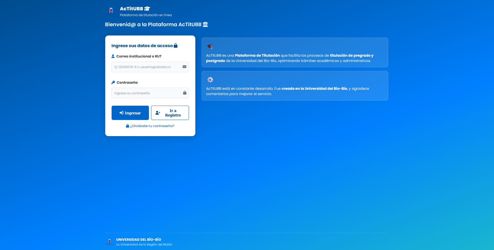
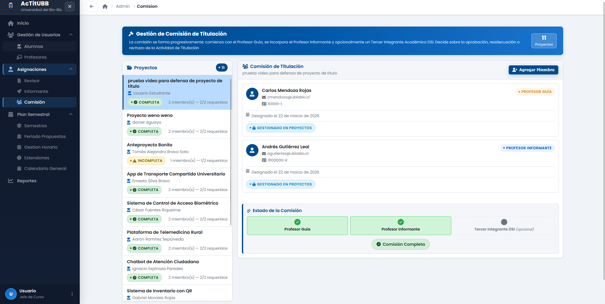
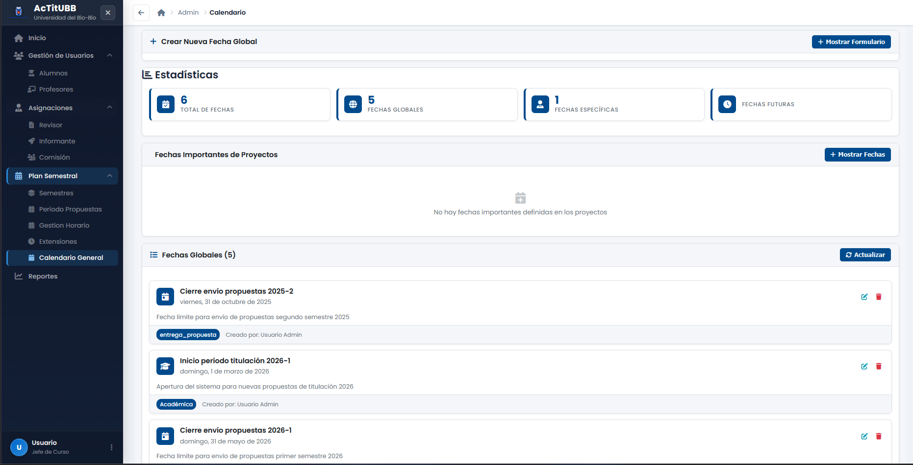
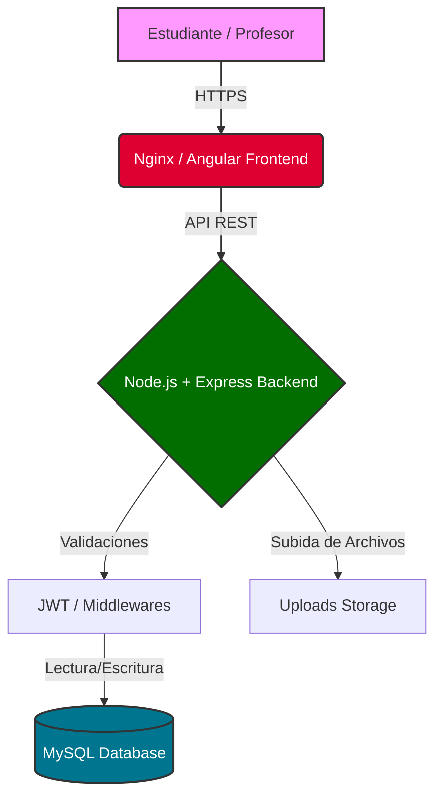

#  AcTitUBB - Sistema para las actividades de titulación en la Universidad del Bío-Bío
## Universidad del Bío-Bío

<div align="center">


**Plataforma de apoyo completa para la gestión de propuestas de tesis, proyectos de título y seguimiento académico**

[](https://www.docker.com/)
[](https://angular.io/)
[](https://nodejs.org/)
[](https://www.mysql.com/)
[](https://www.typescriptlang.org/)
<br>
[](https://github.com/Dantrotel/AcTitUBB/commits/main)
[](https://github.com/Dantrotel/AcTitUBB)

</div>

---

##  Índice
- [ Capturas de Pantalla](#capturas-de-pantalla-del-sistema)
- [ Descripción](#descripción)
- [ Stack Tecnológico Avanzado](#stack-tecnológico-avanzado)
- [ Arquitectura del Sistema](#arquitectura-del-sistema)
- [ Roles y Funcionalidades Detalladas](#roles-y-funcionalidades-detalladas)
- [ Instalación y Despliegue](#instalación-y-despliegue)
- [ Configuración Avanzada](#configuración-avanzada)
- [ Documentación de API Completa](#documentación-de-api-completa)
- [ Recursos Adicionales y Documentación](#recursos-adicionales-y-referencias)

---

##  Capturas de Pantalla del Sistema

A continuación se muestran todas las vistas y flujos principales de la plataforma:

<details>
<summary><b> Acceso y Páginas Principales (Haz clic para expandir)</b></summary>
<br>
<div align="center">

### Login

### Home Estudiante

### Home Profesor

### Home Jefe de Curso


</div>
</details>

<details>
<summary><b> Gestión de Propuestas y Proyectos (Haz clic para expandir)</b></summary>
<br>
<div align="center">

### Formulario de Propuesta

### Periodo de Propuestas

### Gestión de Proyecto

### Gestión Proyectos (Vista Profesor)

### Propuestas Asignadas


</div>
</details>

<details>
<summary><b> Asignaciones y Comisiones (Haz clic para expandir)</b></summary>
<br>
<div align="center">

### Asignación de Evaluador

### Asignación de Informante

### Comisión


</div>
</details>

<details>
<summary><b> Administración y Calendario (Haz clic para expandir)</b></summary>
<br>
<div align="center">

### Gestión de Alumnos

### Gestión de Profesores

### Gestión de Horarios

### Calendario General


</div>
</details>

---

##  Descripción

**AcTitUBB** es una aplicación web avanzada diseñada para el apoyo de la gestión académica en la Universidad del Bío-Bío. El sistema abarca desde la creación de propuestas de tesis hasta el seguimiento de hitos, calendario académico, y gestión de archivos, proporcionando una experiencia integral para estudiantes, profesores y administradores.

###  Características Principales

####  **Gestión de Propuestas**
-  Creación, edición y seguimiento completo de propuestas
-  Estados de propuesta: Borrador, En Revisión, Aprobada, Rechazada
-  Gestión avanzada de archivos con validaciones estrictas
-  Sistema de comentarios bidireccional profesor-estudiante

####  **Sistema de Hitos de Proyectos**
-  Definición y seguimiento de hitos por proyecto
-  Entrega de archivos con validaciones automáticas
-  Control de fechas límite y estados dinámicos
-  Visualización de progreso en tiempo real
-  Revisión y calificación por parte de profesores

####  **Sistema de Fechas Importantes**
-  Gestión centralizada del calendario académico
-  Fechas específicas por proyecto y globales
-  Marcado de fechas como completadas
-  Notificaciones automáticas de vencimientos
-  Vista responsive para móviles y escritorio

####  **Gestión de Usuarios Avanzada**
-  Autenticación JWT segura con blacklist
- ‍ **Estudiantes**: Dashboard personalizado, entrega de hitos, seguimiento
- ‍ **Profesores**: Revisión de entregas, gestión de cronogramas
-  **Administradores**: Control total del sistema y asignaciones

####  **Dashboard Inteligente**
-  Estadísticas en tiempo real por rol
-  Resumen de actividades pendientes
-  Métricas de progreso visual
-  Interfaz completamente responsive

---

##  Stack Tecnológico Avanzado

### Frontend (Angular 18+)
| Tecnología | Versión | Propósito |
|------------|---------|-----------|
| **Angular** | 18.2+ | Framework principal SPA |
| **TypeScript** | 5.0+ | Tipado estático y desarrollo robusto |
| **Angular Material** | 18+ | Componentes UI consistentes |
| **SCSS** | Latest | Estilos avanzados con variables |
| **Vite** | Latest | Build tool ultra-rápido |
| **Nginx** | 1.21+ | Servidor web optimizado |

### Backend (Node.js)
| Tecnología | Versión | Propósito |
|------------|---------|-----------|
| **Node.js** | 20+ | Runtime JavaScript del servidor |
| **Express.js** | 4.18+ | Framework web minimalista |
| **MySQL2** | 3.6+ | Driver MySQL optimizado |
| **JWT** | 9.0+ | Autenticación segura |
| **Multer** | 1.4+ | Manejo de archivos |
| **Nodemailer** | 6.9+ | Sistema de emails |

### Base de Datos y DevOps
| Tecnología | Versión | Propósito |
|------------|---------|-----------|
| **MySQL** | 8.0+ | Base de datos relacional |
| **Docker** | 24+ | Contenedorización |
| **Docker Compose** | 2.0+ | Orquestación de servicios |

---

##  Arquitectura del Sistema

###  Flujo de Datos



###  Estructura Completa del Proyecto

```
AcTitUBB/
├──  backend/                          # API REST con Node.js
│   ├──  src/
│   │   ├──  controllers/              # Controladores MVC
│   │   │   ├── admin.controller.js      # Gestión administrativa
│   │   │   ├── calendario.controller.js  # Fechas importantes
│   │   │   ├── login.controller.js      # Autenticación
│   │   │   ├── project.controller.js    # Proyectos y hitos
│   │   │   ├── propuesta.controller.js  # Propuestas de tesis
│   │   │   └── role.controller.js       # Gestión de roles
│   │   ├──  services/                 # Lógica de negocio
│   │   │   ├── email.service.js         # Notificaciones por email
│   │   │   ├── project.service.js       # Lógica de proyectos
│   │   │   ├── propuesta.service.js     # Lógica de propuestas
│   │   │   └── RutVal.service.js        # Validación RUT chileno
│   │   ├──  models/                   # Modelos de datos
│   │   │   ├── avance.model.js          # Modelo de avances
│   │   │   ├── calendario.model.js      # Modelo de fechas
│   │   │   ├── fecha-importante.model.js # Fechas importantes
│   │   │   ├── project.model.js         # Modelo de proyectos
│   │   │   ├── propuesta.model.js       # Modelo de propuestas
│   │   │   ├── role.model.js            # Modelo de roles
│   │   │   └── user.model.js            # Modelo de usuarios
│   │   ├──  routes/                   # Definición de endpoints
│   │   │   ├── admin.route.js           # Rutas administrativas
│   │   │   ├── calendario.route.js      # Rutas de calendario
│   │   │   ├── download.route.js        # Descarga de archivos
│   │   │   ├── login.route.js           # Rutas de autenticación
│   │   │   ├── project.route.js         # Rutas de proyectos
│   │   │   ├── propuesta.routes.js      # Rutas de propuestas
│   │   │   └── role.route.js            # Rutas de roles
│   │   ├──  middlewares/              # Middlewares personalizados
│   │   │   ├── blacklist.js             # JWT blacklist
│   │   │   ├── uploader.js              # Subida de archivos
│   │   │   └── verifySession.js         # Verificación de sesión
│   │   ├──  db/                       # Base de datos
│   │   │   ├── connectionDB.js          # Pool de conexiones
│   │   │   └── database.sql             # Schema completo
│   │   └── index.js                     # Servidor principal
│   ├──  uploads/                      # Archivos del sistema
│   │   └──  propuestas/               # Documentos de propuestas
│   ├── dockerfile                       # Imagen Docker backend
│   └── package.json                     # Dependencias Node.js
│
├──  frontend/                         # Aplicación Angular
│   ├──  src/app/
│   │   ├──  pages/                    # Páginas principales
│   │   │   ├──  estudiante/           # Módulo estudiante
│   │   │   │   └──  home/             # Dashboard estudiante
│   │   │   ├──  profesor/             # Módulo profesor
│   │   │   │   └──  cronograma/       # Gestión de cronogramas
│   │   │   ├──  admin/                # Panel administrativo
│   │   │   │   ├──  asignaciones/     # Asignación profesor-estudiante
│   │   │   │   ├──  gestion-calendario/ # Calendario global
│   │   │   │   └──  gestion-profesores/ # Gestión de profesores
│   │   │   ├──  propuestas/           # CRUD de propuestas
│   │   │   ├──  login/                # Autenticación
│   │   │   └──  register/             # Registro de usuarios
│   │   ├──  services/                 # Servicios Angular
│   │   │   └── api.ts                   # Cliente HTTP centralizado
│   │   ├──  guards/                   # Guards de seguridad
│   │   │   └── auth.guard.ts            # Protección de rutas
│   │   ├──  interceptors/             # Interceptors HTTP
│   │   │   └── auth.interceptor.ts      # Inyección automática de JWT
│   │   └──  components/               # Componentes reutilizables
│   │       └──  calendar-modal/       # Modal de calendario
│   ├──  public/                       # Recursos estáticos
│   │   ├── Escudo_Universidad_del_Bío-Bío.png
│   │   └── favicon.ico
│   ├── dockerfile                       # Imagen Docker frontend
│   ├── nginx.conf                       # Configuración Nginx
│   ├── angular.json                     # Configuración Angular
│   ├── vite.config.ts                   # Configuración Vite
│   └── package.json                     # Dependencias Angular
│
├──  mysql/                            # Configuración MySQL
│   └──  init.sql/                     # Scripts de inicialización
├── docker-compose.yml                   # Orquestación completa
└── README.md                            # Documentación (este archivo)
```

---

##  Roles y Funcionalidades Detalladas

###  **Estudiante**
#### Dashboard Personalizado
-  **Vista general**: Resumen de propuestas, hitos y fechas importantes
-  **Progreso visual**: Indicadores de avance por proyecto
-  **Notificaciones**: Alertas de vencimientos y actualizaciones

#### Gestión de Propuestas
-  **Crear propuestas**: Formulario completo con validaciones
-  **Adjuntar archivos**: PDF, Word con validaciones de tamaño
-  **Seguimiento**: Estados en tiempo real y comentarios

#### Sistema de Hitos
-  **Entrega de hitos**: Subida de archivos con validaciones estrictas
-  **Control de fechas**: Visualización de deadlines y tiempo restante
-  **Estados dinámicos**: Pendiente, Entregado, En Revisión, Aprobado, Vencido
-  **Comentarios**: Comunicación bidireccional con profesores

#### Calendario Personal
-  **Fechas importantes**: Vista personalizada por proyecto
-  **Completar fechas**: Marcado de hitos cumplidos
-  **Filtros avanzados**: Por proyecto, estado, fecha

### ‍ **Profesor**
#### Panel de Gestión
-  **Propuestas asignadas**: Lista completa con filtros
-  **Estudiantes**: Vista de todos los estudiantes asignados
-  **Estadísticas**: Métricas de desempeño y progreso

#### Revisión de Hitos
-  **Evaluar entregas**: Sistema de calificación integrado
-  **Feedback detallado**: Comentarios estructurados
-  **Aprobación/Rechazo**: Flujo de trabajo simplificado
-  **Seguimiento de progreso**: Vista cronológica de avances

#### Gestión de Cronogramas
-  **Crear fechas específicas**: Por estudiante o proyecto
-  **Definir hitos**: Configuración de deliverables
-  **Notificaciones automáticas**: Alertas de vencimientos
-  **Dashboard de seguimiento**: Vista general de todos los proyectos

###  **Administrador**
#### Gestión de Usuarios
-  **CRUD completo**: Crear, editar, eliminar usuarios
-  **Gestión de roles**: Asignación y modificación de permisos
-  **Estadísticas de uso**: Métricas del sistema

#### Asignaciones Académicas
-  **Profesor-Estudiante**: Sistema de asignación inteligente
-  **Gestión de proyectos**: Vista global de todos los proyectos
-  **Reportes**: Estadísticas de rendimiento académico

#### Calendario Global
-  **Fechas institucionales**: Gestión del calendario académico
-  **Eventos globales**: Fechas que afectan a todos los usuarios
-  **Notificaciones masivas**: Comunicados importantes

---

##  Instalación y Despliegue

### Prerrequisitos

- [Docker](https://www.docker.com/get-started) (versión 24.0+)
- [Docker Compose](https://docs.docker.com/compose/install/) (versión 2.20+)
- Git
- 4GB RAM mínimo recomendado

###  Instalación con Docker (Recomendado)

1. **Clonar el repositorio**
   ```bash
   git clone https://github.com/Dantrotel/AcTitUBB.git
   cd AcTitUBB
   ```

2. **Configurar variables de entorno (opcional)**
   ```bash
   # Crear archivo .env en /backend/ si necesitas configuraciones específicas
   cp backend/.env.example backend/.env
   ```

3. **Levantar todos los servicios**
   ```bash
   docker-compose up --build
   ```

4. **Acceder a la aplicación**
   -  **Frontend**: [http://localhost](http://localhost)
   -  **API Backend**: [http://localhost:3000](http://localhost:3000)
   -  **Base de datos**: localhost:3306 (usuario: `actitubb_user`)

###  Desarrollo Local (Sin Docker)

<details>
<summary>Click para expandir instrucciones de desarrollo local</summary>

**Prerrequisitos de desarrollo:**
- Node.js 20+
- MySQL 8.0+
- Angular CLI 18+

**Backend:**
```bash
cd backend
npm install
npm run dev
```

**Frontend:**
```bash
cd frontend
npm install
ng serve
# O con Vite (más rápido)
npm run dev
```

**Base de Datos:**
```bash
# Instalar MySQL 8.0+
mysql -u root -p < backend/src/db/database.sql

# Configurar variables en backend/.env
DB_HOST=localhost
DB_PORT=3306
DB_NAME=actitubb
DB_USER=root
DB_PASSWORD=tu_password
```

</details>

---

## Configuración Avanzada

> [!NOTE]
> La configuración detallada de Docker, NGINX y variables de entorno ha sido movida a su propio documento para mayor comodidad.
> 📄 **[Ver Guía de Configuración Avanzada](documentacion/CONFIGURACION.md)**

---

##  Documentación de API Completa

###  Autenticación

| Endpoint | Método | Descripción | Body | Respuesta |
|----------|--------|-------------|------|-----------|
| `/api/v1/login` | POST | Iniciar sesión | `{email, password}` | JWT Token |
| `/api/v1/register` | POST | Registro de usuario | `{usuario, email, password, rut}` | Usuario creado |
| `/api/v1/logout` | POST | Cerrar sesión | - | Token invalidado |

**Ejemplo de Login:**
```json
POST /api/v1/login
{
  "email": "estudiante@alumnos.ubiobio.cl",
  "password": "contraseña123"
}

// Respuesta exitosa
{
  "success": true,
  "message": "Login exitoso",
  "data": {
    "token": "eyJhbGciOiJIUzI1NiIsInR5cCI6IkpXVCJ9...",
    "user": {
      "id": 1,
      "usuario": "estudiante",
      "email": "estudiante@alumnos.ubiobio.cl",
      "rol": "estudiante"
    }
  }
}
```

###  Gestión de Propuestas

| Endpoint | Método | Descripción | Rol Requerido | Parámetros |
|----------|--------|-------------|---------------|------------|
| `/api/v1/propuestas` | GET | Listar propuestas | Todos | `?estado=`, `?page=`, `?limit=` |
| `/api/v1/propuestas` | POST | Crear propuesta | Estudiante | FormData con archivo |
| `/api/v1/propuestas/:id` | GET | Obtener propuesta | Todos | - |
| `/api/v1/propuestas/:id` | PUT | Editar propuesta | Estudiante/Admin | FormData |
| `/api/v1/propuestas/:id/comentarios` | POST | Agregar comentario | Profesor/Admin | `{comentario}` |
| `/api/v1/propuestas/:id/estado` | PUT | Cambiar estado | Profesor/Admin | `{estado}` |

###  Sistema de Hitos

| Endpoint | Método | Descripción | Rol Requerido | Body/Params |
|----------|--------|-------------|---------------|-------------|
| `/api/v1/projects/:projectId/hitos` | GET | Listar hitos | Todos | - |
| `/api/v1/projects/:projectId/hitos` | POST | Crear hito | Profesor/Admin | `{nombre, descripcion, fecha_limite}` |
| `/api/v1/hitos/:hitoId/entregar` | POST | Entregar hito | Estudiante | FormData con archivo |
| `/api/v1/hitos/:hitoId/revisar` | POST | Revisar hito | Profesor | `{aprobado, calificacion, comentarios}` |
| `/api/v1/hitos/:hitoId/detalle` | GET | Detalle del hito | Todos | - |

###  Sistema de Fechas Importantes

| Endpoint | Método | Descripción | Rol Requerido | Body/Params |
|----------|--------|-------------|---------------|-------------|
| `/api/v1/fechas-importantes/proyecto/:projectId` | GET | Fechas del proyecto | Todos | - |
| `/api/v1/fechas-importantes` | POST | Crear fecha | Profesor/Admin | `{titulo, descripcion, fecha, proyecto_id}` |
| `/api/v1/fechas-importantes/:fechaId` | PUT | Editar fecha | Profesor/Admin | `{titulo, descripcion, fecha}` |
| `/api/v1/fechas-importantes/:fechaId` | DELETE | Eliminar fecha | Admin | - |
| `/api/v1/fechas-importantes/:fechaId/completar` | POST | Marcar completada | Estudiante | - |

###  Administración

| Endpoint | Método | Descripción | Rol Requerido | Body/Params |
|----------|--------|-------------|---------------|-------------|
| `/api/v1/admin/usuarios` | GET | Listar usuarios | Admin | `?rol=`, `?page=` |
| `/api/v1/admin/usuarios/:userId/asignar` | POST | Asignar profesor | Admin | `{profesor_id, proyecto_id}` |
| `/api/v1/admin/estadisticas` | GET | Estadísticas globales | Admin | - |
| `/api/v1/admin/calendario/global` | POST | Crear fecha global | Admin | `{titulo, descripcion, fecha}` |

---

##  Testing y Calidad de Código

### Ejecución de Tests

```bash
# Tests del Backend
cd backend
npm test                    # Unit tests
npm run test:coverage      # Coverage report
npm run test:integration   # Integration tests

# Tests del Frontend  
cd frontend
ng test                    # Unit tests con Jest
ng test --coverage        # Coverage report
ng e2e                    # End-to-end tests con Cypress
npm run test:lint         # Linting con ESLint
```

### Calidad de Código

```bash
# Backend
npm run lint              # ESLint
npm run lint:fix          # Auto-fix linting issues
npm run format            # Prettier formatting

# Frontend
ng lint                   # Angular ESLint
ng lint --fix            # Auto-fix
npm run format           # Prettier formatting
```

### Métricas de Calidad

-  **Coverage**: >80% en componentes críticos
-  **Linting**: Configuración ESLint estricta
-  **TypeScript**: Strict mode habilitado
-  **Security**: Dependencias auditadas regularmente

---

## Troubleshooting Avanzado

> [!NOTE]
> La guía de solución de problemas comunes, errores de base de datos y comandos útiles ha sido movida a su propio documento.
> 📄 **[Ver Guía de Troubleshooting](documentacion/TROUBLESHOOTING.md)**

---

##  Métricas y Monitoring

### Estadísticas del Sistema

El sistema incluye endpoints para métricas:

```bash
# Estadísticas generales
GET /api/v1/admin/estadisticas

{
  "usuarios_totales": 150,
  "propuestas_activas": 45,
  "hitos_pendientes": 23,
  "fechas_proximas": 8
}

# Métricas por rol
GET /api/v1/admin/estadisticas/rol/:roleId
```

### Performance Monitoring

```bash
# Backend performance
npm run test:performance

# Frontend bundle analysis
ng build --stats-json
npx webpack-bundle-analyzer dist/stats.json

# Database performance
SHOW PROCESSLIST;  # En MySQL
EXPLAIN SELECT * FROM propuestas;  # Query analysis
```

---

##  Seguridad

### Características de Seguridad Implementadas

#### Autenticación y Autorización
-  **JWT con blacklist**: Tokens seguros con invalidación
-  **Bcrypt**: Hash de contraseñas con salt rounds configurable
-  **CORS configurado**: Origen específico para producción

#### Validación de Datos
-  **Sanitización**: Input sanitization en backend
-  **Validación de RUT**: Algoritmo específico para RUT chileno
-  **Validación de archivos**: Tipo y tamaño
-  **SQL Injection**: Prepared statements en todas las queries


### Configuración de Seguridad

```bash
# Configuración de seguridad en backend/.env
JWT_SECRET=clave_super_segura_de_al_menos_64_caracteres
BCRYPT_ROUNDS=12
MAX_LOGIN_ATTEMPTS=5
RATE_LIMIT_WINDOW=15  # minutos
RATE_LIMIT_REQUESTS=100
```

---

##  Deployment en Producción

### Preparación para Producción

1. **Configurar variables de entorno de producción**
2. **Configurar SSL/TLS con Let's Encrypt**
3. **Configurar backup automático de base de datos**
4. **Configurar monitoring y logging**

### Docker Compose para Producción

```yaml
version: '3.8'
services:
  backend:
    build: ./backend
    environment:
      - NODE_ENV=production
      - DB_HOST=mysql
      - JWT_SECRET=${JWT_SECRET}
    restart: unless-stopped
    networks:
      - app-network
    volumes:
      - ./backend/uploads:/app/uploads
      - ./logs:/app/logs

  frontend:
    build: ./frontend
    restart: unless-stopped
    ports:
      - "80:80"
      - "443:443"
    volumes:
      - ./ssl:/etc/nginx/ssl
    depends_on:
      - backend

  mysql:
    image: mysql:8.0
    environment:
      MYSQL_ROOT_PASSWORD: ${MYSQL_ROOT_PASSWORD}
      MYSQL_DATABASE: actitubb
      MYSQL_USER: actitubb_user
      MYSQL_PASSWORD: ${MYSQL_PASSWORD}
    restart: unless-stopped
    volumes:
      - mysql_data:/var/lib/mysql
      - ./backup:/backup
    networks:
      - app-network

  backup:
    image: alpine:latest
    restart: unless-stopped
    volumes:
      - mysql_data:/var/lib/mysql
      - ./backup:/backup
    command: |
      sh -c 'while true; do
        mysqldump -h mysql -u actitubb_user -p$$MYSQL_PASSWORD actitubb > /backup/backup_$$(date +%Y%m%d_%H%M%S).sql
        find /backup -name "backup_*.sql" -mtime +7 -delete
        sleep 86400
      done'

volumes:
  mysql_data:

networks:
  app-network:
    driver: bridge
```

### Monitoreo con Prometheus y Grafana

```yaml
# Agregar al docker-compose.yml
  prometheus:
    image: prom/prometheus
    ports:
      - "9090:9090"
    volumes:
      - ./monitoring/prometheus.yml:/etc/prometheus/prometheus.yml

  grafana:
    image: grafana/grafana
    ports:
      - "3001:3000"
    environment:
      - GF_SECURITY_ADMIN_PASSWORD=${GRAFANA_PASSWORD}
```

---

##  Recursos Adicionales y Referencias

###  Documentación Extendida del Proyecto
Para no saturar este archivo principal, hemos dividido algunas documentaciones específicas en la carpeta `documentacion/`:
-  **[Manual de Usuarios Externos](documentacion/USUARIOS_EXTERNOS.md)**
- ‍ **[Guía de Revisión de Hitos para Profesores](documentacion/GUIA-REVISION-HITOS-PROFESOR.md)**
-  **[Historial de Cambios de la Base de Datos](documentacion/CAMBIOS-DATABASE-UNIFICACION.md)**

### Documentación Técnica
- [ Angular Documentation](https://angular.io/docs)
- [ Vite Build Tool](https://vitejs.dev/guide/)
- [ Docker Best Practices](https://docs.docker.com/develop/dev-best-practices/)
- [ MySQL 8.0 Reference Manual](https://dev.mysql.com/doc/refman/8.0/en/)
- [ Node.js Security Checklist](https://nodejs.org/en/docs/guides/security/)

### Recursos de Desarrollo
- [ Angular Material Components](https://material.angular.io/components)
- [ TypeScript Handbook](https://www.typescriptlang.org/docs/)
- [ Jest Testing Framework](https://jestjs.io/docs/getting-started)
- [ Cypress E2E Testing](https://docs.cypress.io/)

### Herramientas Útiles
- [ VS Code Extensions](https://marketplace.visualstudio.com/vscode) recomendadas:
  - Angular Language Service
  - Docker
  - ESLint
  - Prettier
  - MySQL

---

## Contribución y Desarrollo

> [!IMPORTANT]
> Hemos movido las directrices de contribución, ramas, y estándares de código a su propio archivo para facilitar la lectura. ¡Cualquier PR es bienvenido!
> 🤝 **[Ver Guía de Contribución (CONTRIBUTING.md)](CONTRIBUTING.md)**

##  Licencia y Términos de Uso

### Licencia Académica

Este proyecto está desarrollado para uso académico en la **Universidad del Bío-Bío** bajo los siguientes términos:

-  **Uso académico**: Libre para investigación y educación
-  **Modificación**: Permitida para propósitos educativos
-  **Distribución**: Con atribución apropiada
-  **Uso comercial**: Requiere autorización expresa

---

## ‍ Equipo de Desarrollo

###  **Desarrollador Principal**

<div align="center">

**Daniel Aguayo**  
*Full Stack Developer & Student*

[](https://github.com/Dantrotel)
[](mailto:daniel.aguayo2001@alumnos.ubiobio.cl)

 **Universidad del Bío-Bío**  
 **2026**  
 **Ingeniería de ejecución en computación e Informática**

</div>


###  **Agradecimientos**

- **Universidad del Bío-Bío** - Por el soporte académico
- **Facultad de Ciencias empresariales** - Por los recursos y guidance
- **Profesores guía** - Por la mentoría técnica
- **Comunidad Open Source** - Por las herramientas utilizadas

---

##  Soporte y Contacto

###  **Soporte Técnico**

¿Encontraste un bug o tienes una pregunta técnica?

1. ** Revisa Issues existentes**: [GitHub Issues](https://github.com/Dantrotel/AcTitUBB/issues)
2. ** Contacto directo**: [daniel.aguayo2001@alumnos.ubiobio.cl](mailto:daniel.aguayo2001@alumnos.ubiobio.cl)

---

<div align="center">

##  **¡Gracias por usar AcTitUBB!** 

**Si este proyecto te ayuda en tu trabajo académico, ¡considera darle una estrella! **

---

*Desarrollado con  para la comunidad académica de la Universidad del Bío-Bío*

** 2025 Daniel Aguayo - Universidad del Bío-Bío**

---


</div>
